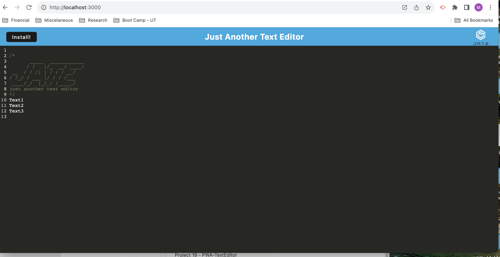
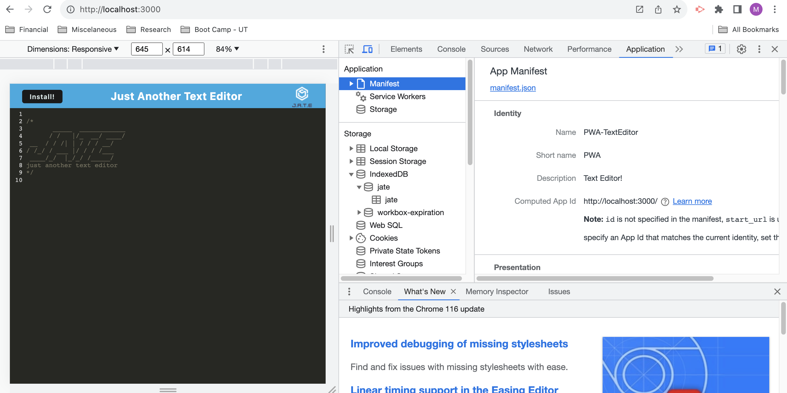
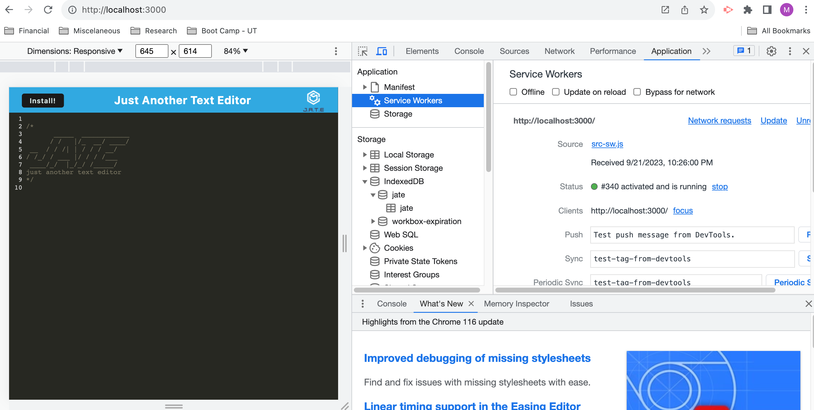
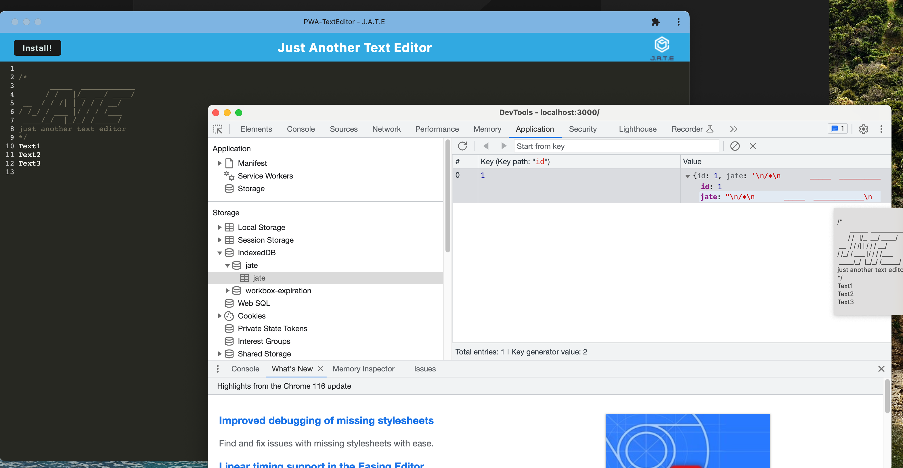

# PWA-TextEditor

## Table of Contents
  - [Description](#description)
  - [Screenshot](#screenshot)
  - [Installation](#installation)
  - [Usage](#usage)
  - [Link](#link)
  - [Contact](#contact)

## Description
This app is a text editor that runs in the browser. The app is a single-page application that meets the PWA criteria.
It is getting and storing data to an IndexedDB database. 

## Screenshot
This application can run form Visual Studio Code by using npm run start:dev.    
     

Manifest    
     

Sevice Worker    
     

IndexDB with installed application    
     

## Installation
1 - On termina: npm i  
2 - On termina: npm run build 
3 - On termina: npm run start:dev  
4 - User can instal application by clicking "Install" button 

## Usage
User can enter text as in any regular text editor.
